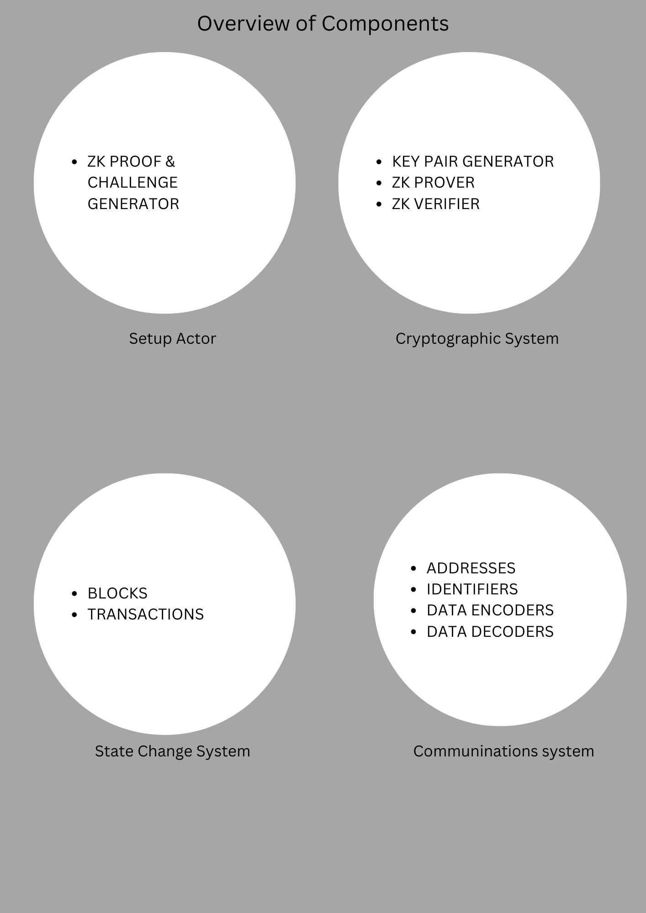

## ShareNet

An extension of the Blockchain paradigm. ShareNet is intended to be a p2p network which encapsulates a decentralized transactional system, enabling users to share physical and digital items.

The system introduces a novel consensus mechanism, called *proof of privilege* for lack of better term.




#### Consensus Mechanism: *proof of privilege*
This concept is derived from simple zero knowledge proofs, the only wrinkle being that privilege is of varying levels and is represented by cryptographic keys.

Let's deconstruct the roles and actions of the setup, prover, and verifier in zero-knowledge cryptographic proofs:

1. Setup:
   - The setup phase will involve the initialization of the cryptographic parameters and protocols that will be used throughout the proof.
   - Both the prover and the verifier agree on these parameters, ensuring they have a common reference for the proof.
   - The setup phase involves generating cryptographic keys, selecting random values and establishing secure channels of communication.

2. Prover:
   - The prover is the party aiming to prove the truthfulness of a statement without revealing the secret information.
   - The prover possesses the secret information related to the statement and wishes to convince the verifier of its truth.
   - The prover engages in interactive rounds with the verifier, responding to challenges and providing convincing evidence without disclosing the secret.
   - The prover commits to the secret information using cryptographic techniques, such as commitment schemes, to demonstrate knowledge without revealing the content.
   - Through the use of the secret information and cryptographic algorithms, the prover constructs responses to the verifier's challenges that convince the verifier of the truthfulness of the statement.

3. Verifier:
   - The verifier is the party that challenges the prover and aims to determine the truthfulness of the statement.
   - The verifier interacts with the prover through a series of interactive rounds, exchanging messages and challenges.
   - The verifier analyzes the responses provided by the prover in each round to evaluate the validity of the proof.
   - The verifier's goal is to be convinced of the truthfulness of the statement while gaining no additional information about the secret.
   - By applying the rules defined by the cryptographic protocol and examining the prover's responses, the verifier reaches a conclusion about the acceptance or rejection of the proof.

The roles of the prover and verifier are distinct, with the prover aiming to convince the verifier without revealing the secret information, and the verifier carefully scrutinizing the evidence to determine the truthfulness of the statement. The setup phase ensures that both parties have a shared understanding of the cryptographic parameters and protocols used in the proof.

## Use Scenarios

### Scene 1

User wants to post a share on the network:
- User posts transaction details to the network.
- Details are encoded on the network and sent to the serverless funtion hosting the linear regression algorthm which predicts a price for the item and recommends a rate.
- Upon return user has the choice to confirm or reject transaction.
  
### Scene 2
User wants to loan an item:
- Query blockchain for shares by providing the required parameters
- User selects a desired item.
- Transaction is confirmed on-chain


### Scene 3
User wants to create or joina subnet for physically adjacent peers:
Subnetting is a transaction, so when a request is made verification is done to ascertain privilege status of the requesting node, if verification is successful a subnet is created with provisions made for populating the subnet pre and post creation. 


**Sample Zero Knowledge Code in Golang Exhibiting The Generation of Verifiably Random Proof**
```go
package main

import (
	"crypto/rand"
	"crypto/sha256"
	"fmt"
	"math/big"
)

const (
	ChallengeLength = 256 // Challenge length in bits
)

// Generate a random prime number
func generatePrime() (*big.Int, error) {
	p, err := rand.Prime(rand.Reader, 256)
	if err != nil {
		return nil, err
	}
	return p, nil
}

// Generate a random scalar in the group Zp
func generateScalar(p *big.Int) (*big.Int, error) {
	s, err := rand.Int(rand.Reader, p)
	if err != nil {
		return nil, err
	}
	return s, nil
}

// Generate a random commitment value
func generateCommitment(p *big.Int, g *big.Int, s *big.Int) *big.Int {
	return new(big.Int).Exp(g, s, p)
}

// Generate a Schnorr proof
func generateProof(p *big.Int, g *big.Int, s *big.Int) (*big.Int, *big.Int) {
	r, err := generateScalar(p)
	if err != nil {
		fmt.Println("Failed to generate random scalar:", err)
		return nil, nil
	}

	v := new(big.Int).Exp(g, r, p)
	eBytes := sha256.Sum256(v.Bytes())
	e := new(big.Int).SetBytes(eBytes[:])

	z := new(big.Int).Mul(s, e)
	z.Add(z, r)
	z.Mod(z, p)

	return v, z
}

// Verify the Schnorr proof
func verifyProof(p *big.Int, g *big.Int, v *big.Int, z *big.Int) bool {
	eBytes := sha256.Sum256(v.Bytes())
	e := new(big.Int).SetBytes(eBytes[:])

	p1 := new(big.Int).Exp(g, z, p)
	p2 := new(big.Int).Exp(v, e, p)

	return p1.Cmp(p2) == 0
}

func main() {
	// Generate a prime number and a generator for the group
	p, err := generatePrime()
	if err != nil {
		fmt.Println("Failed to generate prime number:", err)
		return
	}

	g := big.NewInt(2) // Generator for the group Zp

	// Generate a random scalar and the corresponding commitment
	s, err := generateScalar(p)
	if err != nil {
		fmt.Println("Failed to generate scalar:", err)
		return
	}

	commitment := generateCommitment(p, g, s)

	// Generate a Schnorr proof
	v, z := generateProof(p, g, s)

	// Verify the Schnorr proof
	proofValid := verifyProof(p, g, v, z)
	if proofValid {
		fmt.Println("Proof is valid!")
	} else {
		fmt.Println("Proof is invalid!")
	}
}
```

